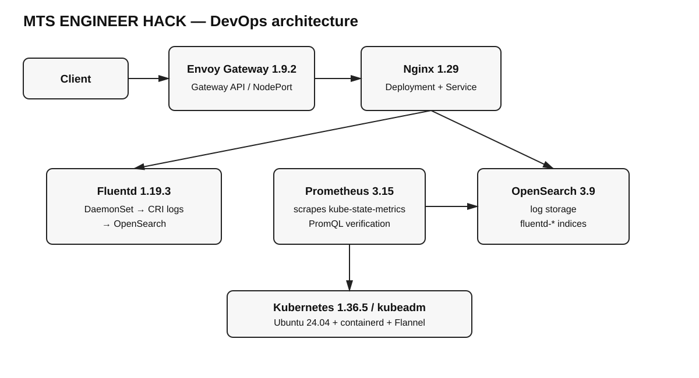

# Паспорт решения — MTS ENGINEER HACK

## Страница 1. Архитектура и состав

**Kubernetes:** 1.36.5, kubeadm. **ОС:** Ubuntu 24.04 LTS. **CNI:** Flannel 0.27.4. **Gateway API:** Envoy Gateway 1.9.2. **Automation:** shell + Kubernetes manifests + GitHub Actions CI. **Monitoring:** Prometheus 3.15.0 + kube-state-metrics 2.20.0. **Logging:** Fluentd 1.19.3-1.1 → OpenSearch 3.9.0.

Пользователь обращается к NodePort Envoy Gateway. Gateway API `Gateway` + `HTTPRoute` направляет запрос в Service Nginx. Nginx пишет access/error logs в stdout/stderr; Fluentd читает CRI logs с узлов и индексирует их в OpenSearch. Prometheus получает cluster-state metrics от kube-state-metrics.

## Страница 2. Реализованный функционал

| Требование | Реализация | Проверка |
|---|---|---|
| Kubernetes | kubeadm 1.36.5, containerd, Flannel | `kubectl get nodes` |
| Web application | Nginx 1.29-alpine, 2 replicas | `curl /` → `Hello from MTS ENGINEER HACK!` |
| Gateway API | Envoy Gateway 1.9.2; GatewayClass/Gateway/HTTPRoute | `kubectl get gateway`, curl через NodePort |
| Monitoring | Prometheus 3.15.0 + KSM 2.20.0 | target `kube-state-metrics`, PromQL `kube_pod_info` |
| Logging | Fluentd DaemonSet → OpenSearch | запрос `/log-check`, поиск в `fluentd-*` |
| Ubuntu 24.04 | основной сценарий рассчитан на Ubuntu 24.04 | `cluster/kubeadm/install.sh` |
| Automation | `deploy.sh`, `smoke-test.sh`, `destroy.sh` | повторный запуск `deploy.sh` |

**Дополнительно:** NodePort без cloud LB; отдельный `/healthz`; отдельный `/log-check`; CI validation; persistent OpenSearch volume; securityContext/resource limits для приложения.

## Страница 3. Ревью и масштабирование

**Главная особенность:** решение не требует коммерческого облака и сводит проверку к нескольким командам. Gateway API, мониторинг и логирование реально связаны с работающим приложением.

**Самое сложное решение:** для bare-metal необходимо было выбрать между LoadBalancer/MetalLB и NodePort. Выбран NodePort, потому что он уменьшает число обязательных компонентов и позволяет воспроизвести Gateway API на обычной Ubuntu VM.

**Дальнейшее развитие:**

- заменить single-node kubeadm на HA-кластер с несколькими control-plane/worker nodes;
- заменить NodePort на MetalLB или облачный LoadBalancer;
- добавить TLS-сертификаты через cert-manager;
- добавить Grafana и dashboards;
- вынести Prometheus/OpenSearch storage на отказоустойчивые PV;
- добавить Alertmanager и SLO/alert rules;
- добавить полноценный CI/CD с image build, security scan и deploy в отдельный environment;
- добавить network policies и более строгий RBAC;
- для production logging включить TLS/authentication OpenSearch.
